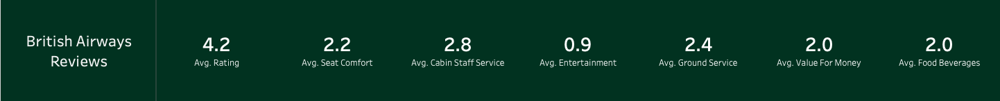
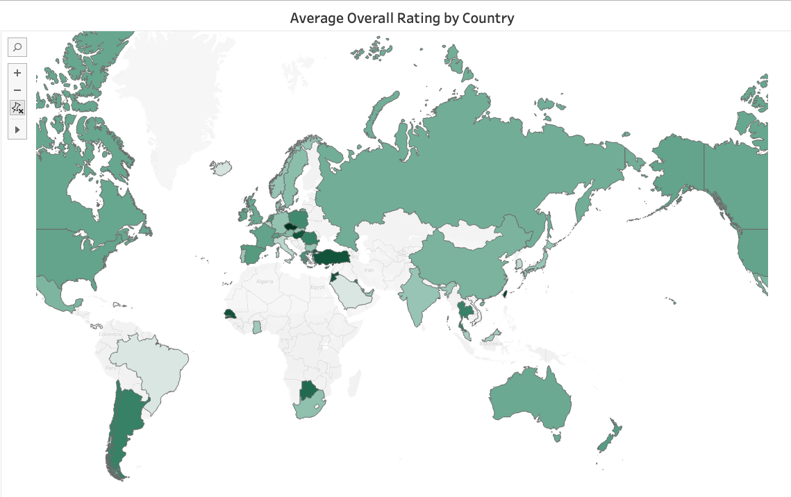
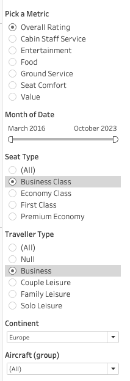

# British-Airways-Reviews-Analysis
This dashboard provides an in depth analysis into British Airways performance. The analysis is based on a variety of key metrics, including overall rating, cabin staff service, entertainment, food and beverages, ground service, seat comfort, and value for money. By analyzing these metrics, we can gain valuable insights into how the airline performs across different service areas.

The dashboard allows for further breakdown by variables such as seat class (economy, business, first class, premium economy) and traveler type (business, couple leisure, family leisure, solo leisure), as well as by months, continents, and aircraft groups (e.g., Boeing, Airbus, A320). Such an analysis is crucial for identifying patterns and trends that can help British Airways enhance customer satisfaction and tailor their services to meet diverse traveler needs.

Please click on this link to view the interactive dashboard on my Tableau Public profile:
https://public.tableau.com/app/profile/bay.yang.jie/viz/BritishAirwaysReviewsAnalysis_17374594899150/Dashboard?publish=yes

# Importing the data
Two tables of data were used for this analysis namely "Reviews" and "Countries". In the 'Reviews' table, each row represnted an individual reviewer and the rating columns for the various key metrics as mentioned above on a scale of 1 to 5 including a metric 'Overall rating' from a scale of 1 to 10. Upon importing the two tables, I joined them based on Place and Country as both would point to the same values.

# Data preprocessing

## Converting variable data type
The variable 'place' was converted from 'string' to 'geographical' data type.

## Creating parameters
The visualisations of the different rating metrics mentioned above (overall rating, cabin staff service, entertainment, food and beverages, ground service, seat comfort, and value for money) were based on factors like Months, Seat Type, Traveller Type, Continent and Aircraft Type.

I incorporated the use of parameters, in this case called 'Pick a Metric' and grouped the key metrics into categories with names that bore the same meanings. I then created a parameter "Pick a Metrc" from which the subsequent calculated fields are then based on.

## Grouping data values
As there were also many aircraft models, I decided to group those models with < 50 reviews on average under 'Others' and show only those aircraft models with > 50 reviews on average.

## Calculated field
The calculated field 'Metric Selected' was created to enable the correct average rating values to be displayed whenever a metric is selected from the parameter 'Pick a Metric'. The CASE WHEN function was used in this case for returning desired values for a metric (condition) specified with the 'WHEN' clause.

# Visualisations

## Summary of metrics 
The summary of metrics at the top of the Dashboard describes the overall average ratings of each metric based on the different variables (Month, Seat Type, Traveller Type, Continent, Aircraft model).

## Line chart - Average overall ratings of metrics by month

## Map chart - Average overall metrics ratings by country

## Bar chart - Average overall metrics ratings by Aircraft

## Filters used for interacting with the charts

# Insights Gathered
The following are the insights that were obtained through this analysis and can be used for sharing with stakeholders in making data driven business decisions.

* The average overall ratings dropped the most between the period of 2020 to 2021. This could have been due to the covid pandemic which resulted in major disruptions to the airline like flight delays/cancellations.

* Food and Entertainment are two aspects that have low average ratings overall as compared to the average ratings of the other metrics. The organisation can focus on upgrading services related to these areas which can help in boosting overall ratings.

* The average overall rating of the airline is 4.2 over the 7-year time frame. This suggests that the airline is doing quite well in terms of customer satisfaction overall. With the help of this in-depth analysis to further focus on the areas for improvement, it would certainly help in improving the overall rating of the airline.
